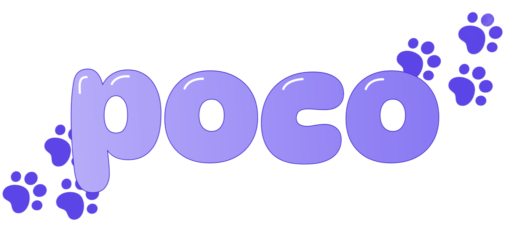
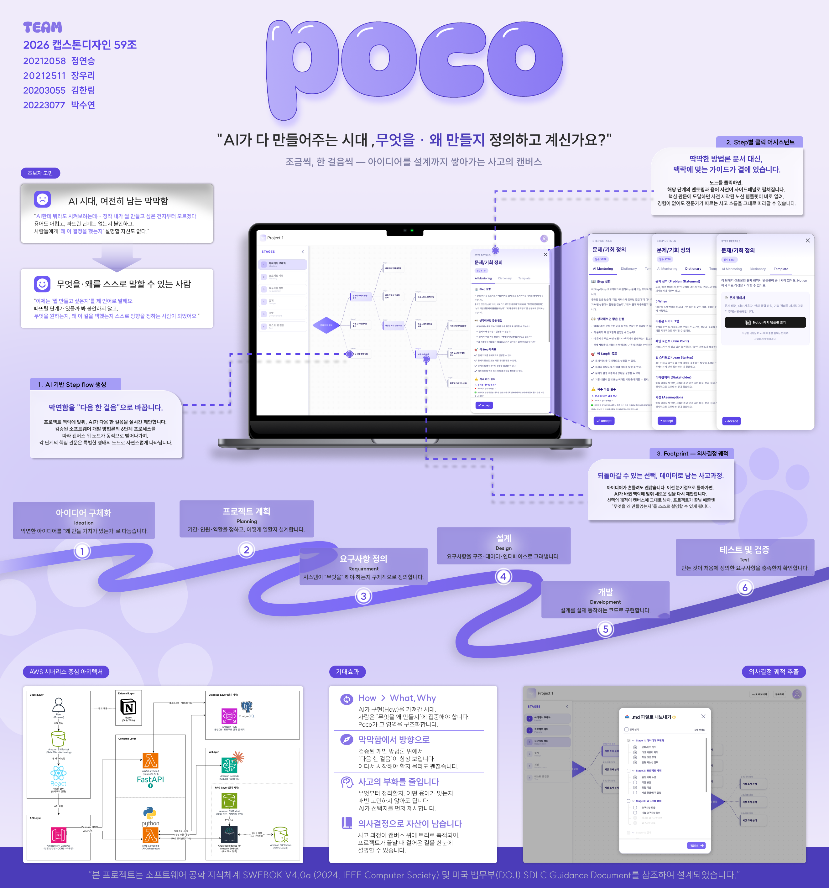
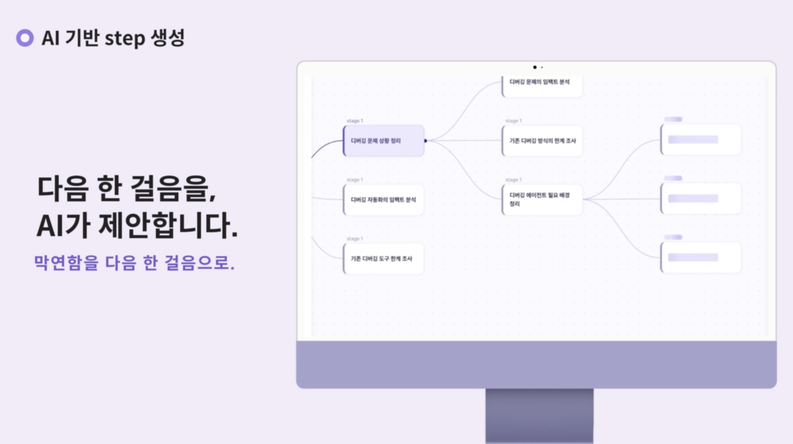
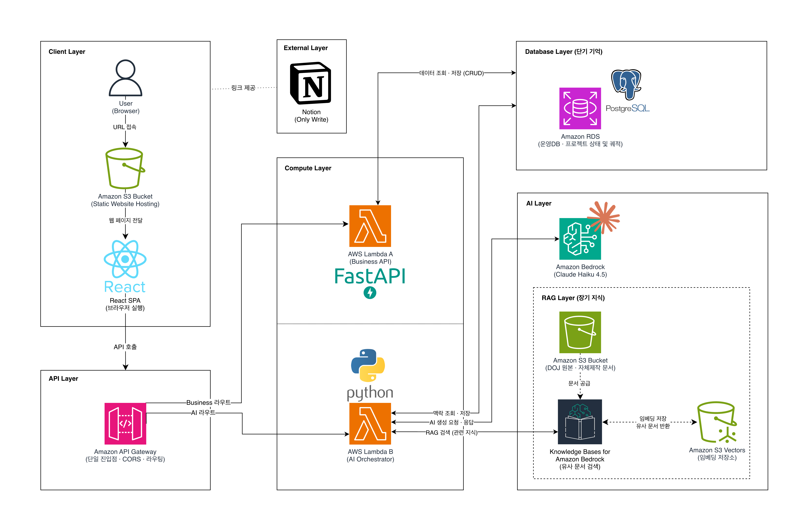
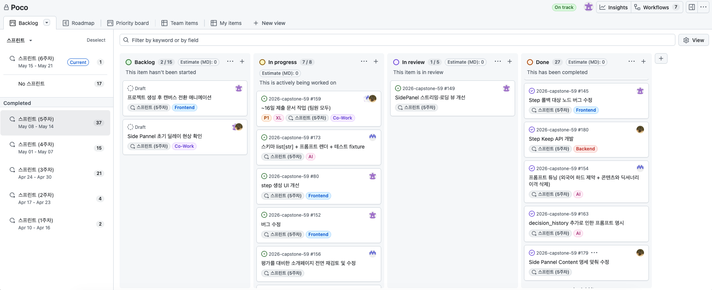

<style>
/* ===== Poco 소개 페이지 — NURINOON 레퍼런스 레이아웃 단순 이식 ===== */

/* ----- 스무스 스크롤 ----- */
html { scroll-behavior: smooth; }

/* ----- Cayman 테마의 초록 헤더 완전 제거 ----- */
.page-header,
header.page-header,
section.page-header,
.site-header,
body > header {
  display: none !important;
}

/* ----- body: 레퍼런스 구조 + margin 결함 보완 ----- */
/* 레퍼런스는 margin-left: 200px 방식이지만, margin 영역은 body 바깥이라
   html 배경이 드러나는 구조적 결함이 있음. 그래서 padding-left 로 전환해
   body 내부에 사이드바 자리를 확보한다. 결과 레이아웃은 레퍼런스와 동일. */
body {
  margin: 0 !important;
  padding: 0 0 0 210px !important;
  box-sizing: border-box;
}

/* ----- 본문 wrapper: 900px 중앙 정렬 ----- */
/* Cayman 기본 wrapper(max-width: 64rem; padding: 2rem 6rem)를 덮어씀.
   body 안에서 가운데 정렬된 좁은 칼럼으로 표현.
   배경은 Cayman 기본값(흰색)을 그대로 유지한다. */
.main-content,
.page-content .wrapper,
main.page-content .wrapper,
body .wrapper {
  max-width: 900px !important;
  width: auto !important;
  margin: 2rem auto !important;
  padding: 0 1.5rem !important;
  box-sizing: border-box;
  line-height: 1.75;
  color: #333;
}

/* ----- 좌측 고정 사이드바 (레퍼런스 스타일 + 목차는 Poco 스타일) ----- */
#poco-side-toc {
  position: fixed;
  top: 0;
  left: 0;
  width: 210px;
  height: 100vh;
  background-color: #f1f5f9;
  border-right: 1px solid #d1d5db;
  display: flex;
  flex-direction: column;
  justify-content: space-between;
  box-shadow: -2px 0 6px rgba(0, 0, 0, 0.05);
  z-index: 999;
  box-sizing: border-box;
}

#poco-side-toc .nav-links {
  overflow-y: auto;
  padding: 28px 14px 16px 18px;
  flex: 1;
}

#poco-side-toc h3 {
  font-size: 18px;
  font-weight: 800;
  margin: 0 0 18px 0;
  color: #000000;
  letter-spacing: 0.02em;
}

#poco-side-toc ol {
  list-style: none;
  padding: 0;
  margin: 0;
  counter-reset: poco-toc;
}

#poco-side-toc li {
  margin: 0 0 6px 0;
  counter-increment: poco-toc;
  line-height: 1.45;
}

#poco-side-toc li a {
  display: block;
  color: #000000;
  text-decoration: none;
  padding: 8px 10px;
  border-radius: 5px;
  font-size: 14.5px;
  font-weight: 500;
  transition: background 0.12s ease, color 0.12s ease;
}

#poco-side-toc li a:hover {
  background: #e2e8f0;
  color: #000000;
}

#poco-side-toc li a::before {
  content: counter(poco-toc) ". ";
  color: #6b7280;
  margin-right: 2px;
}

/* ----- 사이드바 하단 버튼 영역 ----- */
.nav-bottom {
  padding: 1rem;
  border-top: 1px solid #e5e7eb;
  display: flex;
  flex-direction: column;
  gap: 8px;
}

.poco-btn {
  display: flex;
  align-items: center;
  justify-content: center;
  gap: 8px;
  padding: 0.75rem;
  background-color: #ffffff;
  color: #000000 !important;
  text-align: center;
  border-radius: 8px;
  font-weight: 600;
  font-size: 0.95rem;
  text-decoration: none !important;
  border: 1px solid rgb(203, 203, 203);
  transition: background-color 0.2s ease;
}

.poco-btn:hover {
  background-color: #f0f1f4;
}

.poco-btn img {
  width: 18px;
  height: 18px;
  display: inline-block;
  vertical-align: middle;
  object-fit: contain;
}

/* ----- 모바일: 사이드바 숨기고 전체폭 사용 (레퍼런스와 동일 breakpoint) ----- */
@media (max-width: 768px) {
  #poco-side-toc { display: none; }
  body {
    margin: 0 !important;
    padding: 0 !important;
  }
  .main-content,
  .page-content .wrapper,
  main.page-content .wrapper,
  body .wrapper {
    padding: 1rem !important;
    margin: 1rem auto !important;
  }
}

/* ----- Poco 브랜드 컬러 — 헤더·링크 톤 통일 -----
   Cayman 테마의 초록 톤 헤더(h1·h2·h3...)와 파란 링크를 Poco 퍼플로 덮어쓴다.
   사이드바는 기존 검정 톤 유지. */
.main-content h1,
.main-content h2,
.main-content h3,
.main-content h4,
.main-content h5,
.main-content h6,
.page-content h1,
.page-content h2,
.page-content h3,
.page-content h4,
.page-content h5,
.page-content h6,
body .wrapper h1,
body .wrapper h2,
body .wrapper h3,
body .wrapper h4,
body .wrapper h5,
body .wrapper h6 {
  color: #6c63b5 !important; /* Poco 퍼플 — 차분한 톤 (채도 낮춰 눈 편하게) */
}

.main-content h1,
.page-content h1,
body .wrapper h1 {
  border-bottom-color: #ddd6fe !important; /* h1 밑줄 — 옅은 퍼플 */
}

.main-content h2,
.page-content h2,
body .wrapper h2 {
  border-bottom-color: #ede9fe !important; /* h2 밑줄 — 더 옅은 퍼플 */
}

.main-content a,
.page-content a,
body .wrapper a {
  color: #6c63b5 !important; /* 본문 링크 = 차분한 Poco 퍼플 (헤더와 동일 톤) */
}

.main-content a:hover,
.page-content a:hover,
body .wrapper a:hover {
  color: #5b4a9c !important; /* hover 시 살짝 진하게 */
}

/* blockquote 안의 텍스트 + 링크는 회색 톤 (보조 정보용) */
.main-content blockquote,
.page-content blockquote,
body .wrapper blockquote {
  color: #6b7280 !important;
}

.main-content blockquote a,
.page-content blockquote a,
body .wrapper blockquote a {
  color: #6b7280 !important;
  text-decoration: underline;
}

.main-content blockquote a:hover,
.page-content blockquote a:hover,
body .wrapper blockquote a:hover {
  color: #4b5563 !important;
}

/* sub·sup 태그(학술 인용)도 회색 톤 */
.main-content sub,
.main-content sup,
.page-content sub,
.page-content sup,
body .wrapper sub,
body .wrapper sup {
  color: #6b7280 !important;
}

.main-content sub a,
.main-content sup a,
.page-content sub a,
.page-content sup a,
body .wrapper sub a,
body .wrapper sup a {
  color: #6b7280 !important;
}

.main-content sub a:hover,
.main-content sup a:hover,
.page-content sub a:hover,
.page-content sup a:hover,
body .wrapper sub a:hover,
body .wrapper sup a:hover {
  color: #4b5563 !important;
}

/* 사이드바 목차는 기존 검정 톤 유지 — hover 시도 검정 + 옅은 회색 배경 */
#poco-side-toc li a {
  color: #000000 !important;
}

#poco-side-toc h3 {
  color: #6c63b5 !important; /* '목차' 헤더만 본문 헤더와 같은 라벤더 톤 */
}

#poco-side-toc li a:hover {
  background: #e2e8f0 !important;
  color: #000000 !important;
}

/* 본문 안의 .poco-btn, 푸터 링크 등은 별도 스타일 유지 (override X) */
.poco-btn,
.poco-btn:hover,
.poco-btn span,
.poco-btn b {
  color: #000000 !important; /* 사이드바 버튼은 검정 텍스트 유지 */
}
</style>

<nav id="poco-side-toc" aria-label="목차">
  <div class="nav-links">
    <h3>목차</h3>
    <ol>
      <li><a href="#1-프로젝트-소개">프로젝트 소개</a></li>
      <li><a href="#2-문제-정의">문제 정의</a></li>
      <li><a href="#3-해결-방법--top-3-핵심-기능">해결 방법 Top 3</a></li>
      <li><a href="#4-의사결정-궤적-추출--외부-ai와-연결되는-다리">의사결정 궤적 추출</a></li>
      <li><a href="#5-기술-설계">기술 설계</a></li>
      <li><a href="#6-데이터와-확장-가능성">데이터와 확장 가능성</a></li>
      <li><a href="#7-소프트웨어-방법론-근거">방법론 근거</a></li>
      <li><a href="#8-팀-소개-및-협업-방식">팀 소개 및 협업 방식</a></li>
      <li><a href="#9-레포지토리-구조">레포지토리 구조</a></li>
      <li><a href="#10-사용법">사용법</a></li>
    </ol>
  </div>
  <div class="nav-bottom">
    <a class="poco-btn" href="https://github.com/kookmin-sw/2026-capstone-59" target="_blank" rel="noopener">
      
      <span>GitHub 리포지토리</span>
    </a>
    <a class="poco-btn" href="http://pj-kmucd1-09-poco-frontend.s3-website-us-east-1.amazonaws.com/" target="_blank" rel="noopener">
      <span>서비스 바로가기</span>
    </a>
  </div>
</nav>

<p align="center">
  <a href="https://github.com/kookmin-sw/2026-capstone-59">
    
  </a>
</p>

<h3 align="center">조금씩, 한 걸음씩 — 아이디어를 설계까지 쌓아가는 사고의 캔버스</h3>

<p align="center">
  <b>AI가 다 만들어주는 시대, 무엇을 · 왜 만들지 정의하고 계신가요?</b>
</p>

&nbsp;

<p align="center">
  
</p>

## 1. 프로젝트 소개

### 한 줄 요약

> 서비스를 만들고 싶은 사람이 **"뭘 만들고 싶고, 왜 만드는지"** 를 **제 언어로** 말할 수 있도록, AI가 다음 한 걸음의 선택지를 제시하고 의사결정의 궤적을 **트리로 시각화**해주는 **사고의 캔버스**.

### 세 줄 요약

> 만들고 싶은 건 있는데 어디서부터 정리해야 할지 모를 때, AI가 **문제 정의부터 다음 할 일을 단계별로 추천**하고 그 과정을 트리 형태로 시각화해주는 사고의 캔버스.
>
> 각 단계마다 **용어 설명 · 멘토링 · 템플릿**을 제공해서, 처음 시작하는 사람도 **검증된 소프트웨어 개발 프로세스**를 자연스럽게 따라갈 수 있다.
>
> **"어떤 결정을 해왔고, 지금 어디까지 왔는지"** 가 캔버스 위에 트리로 뻗어나가며 한눈에 정리된다.

### 핵심 가치

AI가 엄청난 속도로 모든 것을 만들어주는 시대, 진짜 경쟁력은 이 한 문장으로 요약된다.

> **"무엇을(What) 왜(Why) 만들지 스스로 정의하는 능력"**

AI는 **"어떻게(How)"** 를 엄청난 속도로 만들어준다. 코드도, 디자인도, 문서도. 그러나 AI가 하지 못하는 것이 있다. 바로 *"무엇을 · 왜 만들어야 하는가"* 를 사용자 대신 결정해주는 것. Poco는 사용자가 그 영역을 구조적으로 수행할 수 있도록 돕는다.

### 소개 영상

[](https://youtu.be/dm9nSAuRjMo)

&nbsp;

## 2. 문제 정의

### 2-1. 타겟 사용자

**소프트웨어 프로젝트를 "처음부터 끝까지 스스로 설계해봐야 하는" 사람.**

대표적으로 **캡스톤 · 사이드 프로젝트를 시작하는 개인 또는 1~10명 규모의 소규모 팀**이다. 만들고 싶은 것은 어렴풋이 있지만, *무엇을 어떤 순서로 정의해야 하는지*에 대한 체계적 경험이 아직 쌓이지 않은 상태.

특히 **기능 구현(How)은 AI가 도와주지만, "무엇을 · 왜 만들지(What · Why)"는 여전히 우리 몫이다.** Poco는 그 답을 스스로 찾아가는 구조를 제공한다.

### 2-2. 실제로 겪는 Pain Point

> *"AI한테 뭐라도 시켜보려는데… 정작 내가 뭘 만들고 싶은 건지부터 모르겠다.*  
> *용어도 어렵고, 빠뜨린 단계는 없는지 불안하고, 사람들에게 '왜 이 결정을 했는지' 설명할 자신도 없다."*

뭔가 만들고 싶은데 **"문제 정의 → 요구사항 → 설계 → 개발 → 테스트"** 로 이어지는 흐름을 모른다. 막연한 상태든, 어느 정도 구체화된 상태든 **"다음에 뭘 해야 하는지"** 가 안 보인다.

### 2-3. 기존 방식의 한계

| 구분 | 한계 |
|---|---|
| **Jira / Notion** | 할 일을 *관리*해주지만, **"뭘 해야 하는지" 자체를 알려주지는 않는다.** |
| **방법론 문서 (SWEBOK, PMBOK)** | 수십 년간 검증된 체계적 지식이지만, 수백 페이지 분량의 공식 PDF 형태로만 존재한다. **방법론의 가치를 아는 전문가조차, 막 시작하는 학생 · 초보자가 이걸 직접 펴서 자신의 프로젝트에 적용할 것이라고는 기대하기 어렵다.** |
| **일반 AI 챗봇** | 질문을 잘 던져야 좋은 답을 주는데, **"어떤 질문을 해야 할지 모르는 사람"** 에게는 진입 장벽이 크다. |
| **팀 협업 시** | *"뭘 만들기로 했는지, 왜 이 결정을 했는지"* 가 정리되지 않아 방향이 흐트러지고, 과정이 텍스트로만 남아 **전체 흐름을 한눈에 보기 어렵다.** |

### 2-4. AI 챗봇으로 대체 가능한가?

**대체 불가능하다.** 이유는 세 가지.

1. **"선택지 제시형" 구조의 차별성**
   일반 AI 챗봇은 **사용자가 질문을 던져야** 답한다. 그러나 초심자는 *"무엇을 질문해야 하는지"* 부터 모른다. Poco는 사용자가 질문을 짜내지 않아도 되도록, **AI가 다음 할 일의 선택지 3개를 먼저 제시**한다. 사용자는 *"가장 공감되는 것을 클릭"* 만 하면 된다.

2. **"의사결정 궤적의 시각화"**
   챗봇의 대화는 선형 텍스트로만 남아 **이전 결정으로 되돌아가거나 다른 경로를 탐색하기 어렵다.** Poco는 모든 선택을 **캔버스 위 트리 구조**로 시각화하고, 분기점으로 자유롭게 돌아가 다시 AI 추천을 받을 수 있다.

3. **"검증된 방법론 기반의 안내"**
   챗봇은 매번 답이 흔들릴 수 있다. Poco는 **DOJ SDLC 원문과 팀 자체 제작 가이드**를 RAG 파이프라인으로 엮고, SWEBOK 토픽 구조를 **자체 가이드의 학술적 뼈대**로 삼아, 모든 단계의 안내가 **일관된 방법론의 근거 위에서** 제공된다. *"이 단계에서 이걸 왜 하는지"* 에 대해 항상 같은 학술적 근거를 가진다.

&nbsp;

## 3. 해결 방법 — Top 3 핵심 기능

### ① AI 기반 Step 생성

프로젝트 맥락에 맞춰, AI가 다음 한 걸음을 실시간 제안한다. 검증된 소프트웨어 개발 방법론의 **6단계 프로세스**를 따라 캔버스 위 노드가 동적으로 뻗어나가며, 각 단계의 **핵심 관문**은 특별한 형태의 노드(다이아몬드)로 자연스럽게 나타난다.

> *— 막연함을 "다음 한 걸음"으로 바꾼다.*

### ② Step별 클릭 어시스턴트

노드를 클릭하면, 해당 단계의 **멘토링과 용어 사전**이 사이드패널로 펼쳐진다. 핵심 관문에 도달하면 **팀이 설계한 노션 템플릿**(웹 게시 링크)이 연결되어, 경험이 없어도 사고 흐름을 그대로 따라갈 수 있다.

> *— 딱딱한 방법론 문서 대신, 맥락에 맞는 어시스턴트가 곁에 있다.*

### ③ Footprint — 의사결정 궤적

아이디어가 흔들려도 괜찮다. 이전 분기점으로 돌아가면, AI가 바뀐 맥락에 맞춰 **새로운 길을 다시 제안**한다. 선택의 궤적이 캔버스에 그대로 남아, 프로젝트가 끝날 때쯤엔 **"무엇을 왜 만들었는지"** 를 스스로 설명할 수 있게 된다.

> *— 되돌아갈 수 있는 선택, 트리로 남는 사고 과정.*

&nbsp;

## 4. 의사결정 궤적 추출 — 외부 AI와 연결되는 다리

Top 3 기능으로 사용자의 What · Why가 캔버스에 정리된다. 그런데 결국 코드는 Claude나 ChatGPT 같은 외부 AI가 만들어줘야 한다. 매번 그 AI에게 What · Why 컨텍스트를 다시 설명하는 건 부담스러운 일.

**그래서 Poco는 의사결정 궤적을 한 번에 마크다운(.md) 파일로 추출하는 기능을 제공한다.**

### 4-1. 어떻게 동작하는가

| 단계 | 동작 | 결과 |
|---|---|---|
| 1. | Poco 캔버스에서 사고 정리 | Top 3 기능으로 사용자의 What · Why가 트리에 박힘 |
| 2. | 다운로드 모달에서 구간 선택 | Stage / 필수 Step 단위로 원하는 부분만 선택 가능 |
| 3. | 마크다운(.md) 파일 다운로드 | 사용자의 사고 궤적이 정돈된 문서로 추출 |
| 4. | 외부 AI에 첨부 | Claude · ChatGPT · Cursor · Codex 등 어디든 |

### 4-2. 무엇이 달라지는가 — Gemini 실측 비교

같은 외부 AI(Gemini Pro)에 같은 입력 *"AI 디버깅 에이전트 만들고 싶어"* 를 던졌을 때, **Poco가 추출해준 마크다운을 첨부했냐 안 했냐** 만 다른데 답변 차원이 달라진다.

<table>
  <tr>
    <th width="50%" style="background:#f3f4f6; color:#6b7280;">Before</th>
    <th width="50%" style="background:#eeecf7; color:#6c63b5;">After</th>
  </tr>
  <tr>
    <td></td>
    <td></td>
  </tr>
  <tr>
    <td>
      <b>표면 분류 묻기 (사용자에게 다시 공을 던짐)</b><br/>
      <em>"어떤 프로그래밍 언어나 특정 프레임워크를 타겟으로 하는 디버깅 에이전트를 먼저 기획하고 계신가요?"</em>
    </td>
    <td>
      <b>사용자에 맞춘 구체적 다음 한 걸음</b><br/>
      <em>"최근 팀 내에서 발생했던 가장 까다로웠던 버그 사례 1~2가지를 ... 작업을 시작해보면 어떨까요?"</em>
    </td>
  </tr>
</table>

> [실제 Gemini 채팅 검증 링크](https://gemini.google.com/share/f7511935947a)
>
> [실제 인용된 의사결정 궤적 .md 보러가기](./assets/design_2026-05-17_03-25.md)

### 4-3. 의미 — Poco의 역할이 외부 AI와 충돌하지 않는다

Poco는 *"What · Why를 정의하는 도구"* 이고, 외부 AI(Claude · ChatGPT · Cursor · Codex 등)는 *"How를 구현하는 도구"* 다. **의사결정 궤적의 .md 추출은 그 둘을 연결하는 다리**다.

- **Poco** — 사용자 사고 정리 (What · Why)
- **.md (의사결정 궤적)** — 두 도구를 잇는 번역 매개
- **외부 AI** — 코드 · 디자인 · 문서 생성 (How)

같은 .md를 Gemini가 아닌 Claude에 첨부했을 때도 동일한 효과(차원 변환)가 확인되었다. *"답변 패턴이 다른 두 외부 AI인데, .md 한 장이 답변 차원을 바꾼다"*. **Poco의 안내 품질은 특정 외부 AI에 종속되지 않는 보편적 시스템 프롬프트 페이로드 형태로 설계되어 있다.**

> *— 의사결정 궤적이 .md로 남으니, 외부 AI도 사용자 맥락을 이해한다.*

&nbsp;

## 5. 기술 설계

### 5-1. AWS 서버리스 중심 아키텍처

<!-- 이미지 파일(`assets/architecture.png`) 업로드 후 아래 이미지가 자동 표시됩니다. -->

<div id="arch-placeholder" style="display:none; padding:2rem; background:#f6f8fa; border:1px dashed #d0d7de; border-radius:6px; text-align:center; color:#57606a;">
  📐 아키텍처 다이어그램 준비 중입니다.
</div>

> RAG 파이프라인과 "단기 기억 · 장기 지식" 분리 설계로, AI가 검증된 방법론을 실시간 참조합니다.

### 5-2. 설계 철학 — "단기 기억 · 장기 지식" 분리

| 구분 | 역할 | 저장소 |
|---|---|---|
| **단기 기억 (Short-term)** | 프로젝트별 상태, Step 히스토리, 사용자 선택 궤적 | **Amazon RDS PostgreSQL** |
| **장기 지식 (Long-term)** | DOJ SDLC, SWEBOK, 자체 제작 가이드의 임베딩 | **Amazon S3 Vectors + Amazon Bedrock Knowledge Bases** |

이 분리 설계가 왜 중요한가? 프로젝트마다 *상태*는 매 요청마다 갱신되지만, *방법론 지식*은 거의 변하지 않는다. 변경 빈도와 접근 패턴이 **완전히 다른 두 층**을 하나의 DB에 섞으면 확장성과 비용 효율이 모두 나빠진다. 그래서 저장소부터 구조적으로 분리하여, **지식은 한 번만 인덱싱하고 여러 프로젝트가 공유**하도록 했다.

### 5-3. 기술 스택

**Frontend**


**Backend**


**AI & RAG**


**DevOps (Local)**


### 5-4. 실시간 진행 상태 판단 — FE · BE · AI가 한 영역으로 풀어내는 로직

Poco의 가장 복잡한 부분은 노드 출력 뒷단에서, **AI 판단 · 백엔드 상태 머신 · 프론트엔드 시각 효과가 한 사이클 안에 맞물려 돌아가는 통합 로직**이라는 점이다. 사용자가 *"노드를 클릭하는 순간"*, 그 뒤에서 일어나는 일은 다음과 같다.

**시나리오 — 사용자가 일반 Step을 Accept한 순간**

```
Frontend (CanvasPage)
  └─ POST /steps/{id}/accept
       │
       ▼
Backend Lambda (AI Orchestrator)
  ├─ ① Step 상태를 ACCEPTED로 마킹 (RDS 트랜잭션)
  ├─ ② 현재 진행 중인 필수 Step의 충족 여부를 체크할지 결정
  │     └─ 이미 충족이면 accept 호출 스킵 (불필요한 LLM 비용 절감)
  ├─ ③ asyncio.gather 로 두 LLM 호출을 병렬 실행
  │     ├─ accept   ─→ Anthropic Claude (충족 기준 측면 매칭 판단)
  │     └─ generate ─→ Anthropic Claude + Bedrock KB Retrieve (다음 Step 3개)
  ├─ ④ 충족 판단이 true면 ProjectRequiredStepStatus.is_fulfilled = true 업서트
  ├─ ⑤ 모든 필수 Step이 충족되었는지 검사 → Stage 진행 판단 (순수 규칙, AI 호출 X)
  ├─ ⑥ 다음 Stage가 활성화되면 ProjectStage.is_active 이동
  ├─ ⑦ 다음 미충족 필수 Step을 derive → 다이아몬드 노드를 캔버스에 조합
  └─ 응답: 일반 노드 3개 (+ 조건부 다이아몬드 노드 1개)
       │
       ▼
Frontend
  ├─ 다이아몬드 노드 등장 애니메이션 (framer-motion: opacity + scale + slide-in)
  ├─ 좌측 Stage Navigator 활성화 토글 (다음 Stage가 흐릿 → 클릭 가능)
  └─ 다이아몬드 노드 클릭 시 토스트 알림 (3초 자동 소멸 + 토글 재확인)
```

**왜 이렇게까지 복잡한가**

사용자에게는 *"필수 Step"* 이라는 용어를 노출하지 않기로 했다. 하지만 *"체계적 방법론을 따라가고 있다"* 는 감각은 줘야 한다. 이 모순을 *"용어가 아닌 형태와 타이밍"* 으로 풀었다.

| 기능 | 구현 영역 | 근거 |
|---|---|---|
| **충족 기준 측면 매칭** | AI 프롬프트 (24개 필수 Step의 측면 리스트 주입) | 측면 중 2개 이상 커버하면 충족. AI가 자유 텍스트가 아닌 *"인덱스 자기검증"* 으로 답하도록 출력 스키마 강제 |
| **accept · generate 병렬 호출** | 백엔드 `asyncio.gather` | 두 LLM 호출을 직렬로 하면 사용자 대기 시간이 8~10초로 늘어남. 병렬화로 4~5초로 단축 |
| **다이아몬드 노드 derive** | 백엔드 (AI 응답 후처리) | AI는 *"이 필수 Step이 충족됐냐"* 만 판단하고, *"다음 다이아몬드를 띄울지"* 는 백엔드가 RDS의 RS Status를 보고 derive. AI 환각 차단 |
| **노드 등장 애니메이션** | 프론트엔드 (framer-motion) | phase A(자리 잡기) → phase B(슬라이드 인) 두 단계로 분리. 기존 노드와 충돌 없이 자연스럽게 끼어듦 |
| **토스트 고정 문자열** | 프론트엔드 + DB seed | AI 동적 생성 X. 24개 필수 Step별로 사전 정의된 한국어 문자열을 DB에서 lookup. 톤 일관성 확보 |
| **Stage Navigator 활성화** | 프론트엔드 (반응형 상태) | 백엔드의 `is_current_stage_completed` 플래그를 받아 좌측 패널의 다음 Stage가 흐릿 → 클릭 가능으로 전환 |

**다이아몬드 노드의 이월 규칙 — 강제하지 않으면서 따라오게 하는 설계**

다이아몬드 노드는 *"반드시 클릭해야 다음으로 넘어가는 관문"* 이 아니다. 사용자에게는 *"필수 Step"* 이라는 용어조차 보이지 않는다. 그래서 사용자는 다이아몬드 노드 대신 일반 노드를 선택해도 자유롭게 진행할 수 있어야 하고, 그래도 *"빠뜨린 게 있는 것처럼"* 느껴지면 안 된다. 이 모순은 **노드의 이월(carry-over) 규칙**으로 풀었다.

| 사용자 행동 | 캔버스 동작 |
|---|---|
| AI가 *"이 필수 Step에 진입할 때가 됐다"* 고 판단 | 일반 노드 3개 + 다이아몬드 노드 1개 = **총 4개** 동시 표시 |
| 다이아몬드 노드 선택 | 해당 필수 Step에 관한 하위 노드 3개가 생성. 이후 정상 진행 |
| 다이아몬드 대신 **일반 노드 선택** | 선택되지 않은 다이아몬드 노드는 해당 분기에서 자연스럽게 사라짐 |
| 다음 Step Accept 시 | **사라졌던 다이아몬드 노드가 다음 트리에 다시 나타남** (AI가 충족됐다고 판단할 때까지 계속 따라옴) |

즉, *"필수이긴 한데 강제하지 않는"* 묘한 균형을 노드의 출현/소멸/재등장으로 표현했다. 사용자는 *"좋은 결정"* 으로 보이는 일반 노드를 자유롭게 골라도 되고, 그래도 다음 트리에서 다이아몬드가 다시 인사하니 빠뜨릴 일도 없다. 강제하지 않으면서도 체계적 흐름을 따라가게 하는 *"부드러운 안내"* 의 핵심 장치다.

**측면(Aspect) 기반 충족 판단 — 왜 이 방식을 골랐나**

24개 필수 Step 각각에 *"충족 기준 측면"* 이 4~5개씩 정의되어 있다. 예를 들어 *"문제/기회 정의"* 는 `[문제 자체 서술, 중요도, 발생 배경, 기존 대안의 한계]` 4가지 측면을 가진다. AI는 사용자의 하위 Step 히스토리를 보고 *"이 중 2개 이상이 커버됐는가"* 를 판단한다.

자유 텍스트로 *"충족됐어"* 만 받으면 LLM 환각이 잡히지 않는다. 그래서 출력 스키마를 `covered_aspect_index: [int]` 형태로 강제하고, **자기검증을 LLM이 답할 때 같이 적게 했다.** 측면 인덱스가 매핑되지 않으면 백엔드가 재호출. *"근거 없는 충족 판단"* 을 구조적으로 차단한 설계다.

### 5-5. 백엔드 상태 머신 — Stage · 필수 Step · 롤백의 정합성

Poco는 *"되돌아갈 수 있는 사고"* 를 핵심 가치로 내세우는 만큼, 롤백이 일어났을 때도 데이터 정합성이 깨지지 않아야 한다. 이를 위해 백엔드는 단순 CRUD가 아니라, **여러 테이블에 걸친 상태 머신**을 운영한다.

**Step 트리 — Closure Table 패턴**

자기참조 FK(`parent_step_id`)만으로는 *"이 Step의 모든 조상 / 자손"* 을 가져올 때마다 재귀 쿼리가 필요해진다. 그래서 별도의 **Closure Table** (`step_path`, `(ancestor, descendant, depth)` 컬럼)을 두어 모든 조상-자손 관계를 평탄화 저장한다. 이 덕분에 다음과 같은 연산이 모두 단일 SELECT/DELETE로 끝난다:

- 특정 Step의 모든 조상을 ACCEPTED로 일괄 복원
- 특정 Stage의 모든 Step을 일괄 삭제 (자기참조 FK 회피용 detach → delete 2-step)
- 트리 시각화에 필요한 *"루트 → 현재 노드"* 경로 추출

**Stage 내 롤백 — 자식 있는 Step 차단 + 같은 Stage 일괄 CANCELED**

사용자가 분기점으로 돌아가려고 할 때, 백엔드는 다음 불변식을 보장한다:

1. **같은 Stage 내 모든 ACCEPTED Step을 CANCELED로 일괄 마킹** — 분기 외 결정은 *"진행 중이 아님"* 으로 통일
2. **롤백 대상의 조상만 ACCEPTED 복원** — 트리 위쪽 한 줄기만 활성 상태로 남김
3. **필수 Step 충족 상태 재정렬** — 롤백 대상이 속한 RS의 sequence를 기준으로 *"이전 RS는 fulfilled, 이후 RS는 unfulfilled"* 로 자동 재계산

이 단계들이 한 트랜잭션 안에서 일어나, 어느 단계에서 실패해도 일관성을 잃지 않는다.

### 5-6. 백엔드의 AI 의존도와 기여점

**AI 의존 범위 (정확히 명시)**

| AI가 담당하는 일 | AI가 담당하지 **않는** 일 |
|---|---|
| 다음 Step 3개 동적 생성 (`generate`) | 6개 Stage 정의 (백엔드 DB에 고정) |
| 필수 Step 충족 판단 (`accept`) | 24개 필수 Step의 목표 · 진입 · 충족 기준 정의 (팀 자체 정의) |
| 사이드패널 멘토링 · 용어 생성 (`side_panel`, 일반 Step만) | 필수 Step 사이드패널 콘텐츠 (팀 자체 제작, DB 사전 저장) |
| 의사결정 궤적 .md 추출 (`design_export`) | 필수 Step 노션 템플릿 (팀 자체 제작) |
| — | Stage 진행 판단 (규칙 기반, AI 호출 없음) |

즉 **AI는 "동적 생성이 필요한 4개 시나리오"에만 한정**되고, 나머지는 모두 사전 정의된 자산 · 규칙 기반으로 돌아간다. AI가 뱉어낸 결과물을 그대로 노출하는 것이 아니라, **팀이 설계한 구조(Stage · 필수 Step · 충족 기준)의 틀 안에서 작동**하도록 제약했다.

**프론트엔드/UX의 차별화된 기여**

1. **캔버스 기반 트리 시각화** — 기존 챗봇의 선형 대화와 달리, 사용자의 **의사결정 궤적**을 분기 · 롤백 가능한 시각적 구조로 제공한다. 이것은 AI가 아닌 **프론트엔드의 상호작용 설계**의 몫이다.
2. **핵심 관문 노드(다이아몬드)의 UX** — *"필수 Step"* 이라는 용어를 사용자에게 노출하지 않고, **특별한 형태의 노드**로만 인식되도록 설계. 체계적 방법론을 따라가고 있다는 감각을 자연스럽게 형성한다.
3. **사이드패널 탭 구조** — **AI 멘토링 / 용어 사전** 두 탭을 사이드패널로 제공하고, 핵심 관문에서는 **팀이 설계한 노션 템플릿**(웹 게시 링크)이 연결되는 구조.
4. **Footprint 시각화** — 롤백 · 재탐색이 캔버스 위에서 직관적으로 이루어지도록, 선택의 궤적을 **시간이 아닌 공간(트리)** 에 남기는 방식을 채택.

&nbsp;

## 6. 데이터와 확장 가능성

### 6-1. 서비스가 축적하는 데이터와 가치

**수집되는 정보**

| 데이터 | 성격 |
|---|---|
| **사용자 행동** | 어떤 노드에서 많이 막히는지(이탈 지점), 어떤 선택지를 많이 고르는지, 어떤 분기에서 롤백하는지 |
| **기획 결과** | 어떤 노드 선택으로 프로젝트를 마무리했는지, 어떤 주제 · 도메인 프로젝트가 많이 기획되는지, 많이 선택된 노드 조합 |
| **의사결정 궤적 추출** | 어떤 시점(Stage / 필수 Step)에서 추출이 일어나는지, 어떤 구간이 자주 추출되는지 |
| **AI 성능 피드백** | AI가 생성한 Step 중 실제로 Accept된 비율, 어떤 RAG 검색 결과가 실제 선택으로 이어졌는지 |

**예상 가치**

- **교육 자산화** — 초심자가 **어디에서 멈추는지**가 데이터로 남으면, 개발 교육 커리큘럼의 취약점을 정량적으로 보완할 수 있다.
- **방법론 개선 루프** — DOJ SDLC · SWEBOK의 **이론과 실제 사용 패턴 차이**를 데이터로 관찰하여, 자체 제작 가이드 문서를 지속 개선할 수 있다.
- **AI 프롬프트 · RAG 품질 개선** — 실제 Accept된 Step의 맥락을 분석하여, 동적 생성 AI의 프롬프트와 RAG 검색 전략을 데이터 기반으로 튜닝한다.
- **추출 시점 · 구간 패턴 관찰** — 사용자가 어느 시점(Stage / 필수 Step)에서 의사결정 궤적을 추출하는지, 어떤 구간이 자주 추출되는지를 추적할 수 있다. 시점 · 구간의 분포 패턴은 사용자 행동을 이해하는 단서가 된다.

### 6-2. 확장 가능성

**사고 프레임은 누구의 것이든 될 수 있다**

Poco가 What · Why를 정의하도록 돕는 방식의 본질은 *"검증된 사고 절차를 따라가게 한다"* 는 데 있다. 현재는 DOJ SDLC를 그 사고 절차로 채택했지만, **Stage 정의서 + 필수 Step 충족 기준 측면 + 템플릿 3종 세트**만 교체하면 *어떤 사고 프레임이든* 같은 캔버스 위에서 동작한다. 방법론은 그 프레임의 한 종류일 뿐.

| 사고 프레임 종류 | 예시 | 시장·대상 |
|---|---|---|
| **소프트웨어 개발 방법론** | DOJ SDLC, Agile, Scrum, XP, V-Model | 캡스톤 · 사이드 프로젝트 · 인디 창업팀 (현재 Poco의 출발점) |
| **타 도메인 표준 프로세스** | PMBOK(제품 기획), IMRaD(연구 프로젝트), Double Diamond(UX 리서치), 학술 논문 구조 | 연구실 · 제품 기획팀 · UX 팀 |
| **기업 온보딩 문화** | 구글, 토스, 아마존의 신입 온보딩 프레임 | 기업 신입 사원 · 입사 준비 중인 취준생 |
| **유명인의 사고** | 워렌 버핏의 가치투자, 일론 머스크의 first-principles, 제프 베이조스의 고객 집착 | 누구든 — *"저 사람처럼 생각해보고 싶다"* 는 모든 사용자 |

각 경우에서 *"프레임은 정해두지만, 사고는 사용자 자유"* 라는 Poco의 원칙은 그대로 유지된다. 프레임을 바꾸면 시장이 바뀌고, 그 결과물(사용자의 의사결정 궤적)은 동일한 .md 추출 기능으로 외부 AI까지 자연스럽게 이어진다.

**프리셋 공유 마켓플레이스로의 발전 가능성**

기술 구조상, 사고 프레임은 **S3 Vectors의 인덱싱 단위**로 다룰 수 있다. 새 프레임을 만들어 올리는 것이 *"새 데이터 인덱스 추가"* 수준의 비용이라는 의미다. 이 특성을 살리면 **Poco 내에서 사용자들이 자기만의 사고 프레임 프리셋을 자유롭게 공유 · 다운로드하는 마켓플레이스**로 발전 가능하다. 인기 프리셋이 거래되는 구조까지 자연스럽게 이어진다.

**S3 Vectors를 RAG 저장소로 선택한 이유**

| 선택지 | S3 Vectors를 선택한 근거 |
|---|---|
| **비용 효율** | 전용 벡터 DB(OpenSearch · Pinecone)의 **최대 1/10 수준 비용**. 캡스톤 · 교육 · 스타트업 규모에서 운영 부담이 크게 낮다. |
| **Bedrock 네이티브 통합** | Bedrock Knowledge Base가 **S3 Vectors를 데이터소스로 직접 지원**. 별도 ETL · 동기화 파이프라인 없이 콘솔에서 바로 인덱싱. |
| **스케일 특성** | 장기 지식은 **읽기 비중이 압도적**이고 쓰기는 드물다. S3의 **객체 스토리지 + 벡터 인덱스 결합 구조**가 이 패턴에 최적. |
| **메타데이터 필터링** | Stage/Step/문서 유형(DOJ vs Custom)별 메타데이터 필터링을 네이티브 지원 → 같은 인덱스 안에서도 정밀 검색 가능. |

결과적으로 **새 사고 프레임을 추가할 때마다 인덱스를 복제하거나 별도 DB를 띄울 필요 없이**, 동일 저장소에 메타데이터만 붙여 추가할 수 있다. 운영 비용을 올리지 않고도 지식 레이어가 선형 확장되는 구조다.

### 6-3. 프로젝트 규모의 적절성

**결론: 적절하다.** 근거는 세 가지.

1. **분명한 역할 분리 + 상호 의존성 존재**
   FE(1명) · BE(2명) · AI/Infra(1명, 팀장)로 나뉘되, 각 파트가 **독립적으로 개발 가능**하면서도 **최종 통합 시 팀 협업이 필수**인 구조. 1인 프로젝트로는 전 영역을 깊이 있게 다루기 어려운 스코프다.
2. **AI 자동화로도 대체 안 되는 설계 영역**
   24개 필수 Step의 **목표 · 진입 · 충족 기준 정의**, 사이드패널 콘텐츠 자체 제작, 노션 템플릿 설계 등은 **팀의 전문적 판단**이 필요한 영역이다. AI가 코드는 도와주지만, *"어떤 기준으로 필수 Step을 정의할 것인가"* 는 팀이 설계해야 한다.
3. **AWS 아키텍처의 운영 복잡도**
   Bedrock, Lambda 2개, RDS, S3 Vectors, Knowledge Base 등 **8개 AWS 서비스**를 연동하고 CI/CD · 배포 · 모니터링까지 구축하는 것은 1인 스코프로는 부담이 크다.

**AI 활용으로 팀이 더 집중한 영역** — 단순 코드 작성에 들어가던 공수를 **도메인 설계 · 방법론 문서 작성 · UX 실험 · RAG 품질 튜닝** 등 AI가 대체할 수 없는 영역에 재배치했다.

&nbsp;

## 7. 소프트웨어 방법론 근거

Poco가 참조하는 학술적 근거와, 각 출처가 실제 서비스 어디에서 어떻게 사용되는지를 투명하게 공개한다.

### 7-1. 참조 문서와 자체 제작 가이드 — 왜 이 구조인가

Poco의 방법론 구조는 **"갖다 쓴 것"이 아니라 "재가공한 것"** 이다. 핵심 흐름은 다음과 같다.

**① DOJ SDLC가 가장 큰 틀이다.**

미국 법무부(**DOJ**)가 공공 소프트웨어 개발 프로세스의 표준으로 공식 배포한 **SDLC Guidance Document**는 원래 **10단계 Phase**로 구성되어 있다. Poco는 이 원문을 **그대로 RAG 지식 저장소에 탑재**하여 AI가 참조하도록 하되, 서비스의 Stage 구조는 타겟 사용자(초심자 · 소규모 팀 · 1~12개월 프로젝트)에게 **실제로 필요한 6단계만 선별**하여 별도로 설계했다. 각 Stage의 목표 · 진입 기준 · 충족 기준, 그리고 Stage별 필수 Step 4개씩(총 24개)의 정의는 모두 **팀의 설계 판단**이다.

**② SWEBOK는 "보완용 참고"로만 활용한다.**

**SWEBOK V4.0a** (2024, IEEE Computer Society)는 소프트웨어 공학 지식체계의 국제 표준이지만, 저작권 보호 대상이라 원문을 RAG에 탑재할 수 없다. Poco는 SWEBOK의 **토픽 구조(Knowledge Area → Topic)만 참조**하여, AI가 혼자서는 잘 답하지 못하는 영역의 자체 가이드를 작성할 때 **학술적 근거와 구조의 뼈대**로 활용했다. 즉 SWEBOK 자체를 서비스에 노출하는 것이 아니라, 팀이 작성한 가이드의 *출처 신뢰도를 확보하는 용도*다.

**③ 팀의 재검토 · 가공이 핵심이다.**

두 문서 모두 수백 페이지 분량의 영문 공식 PDF이며, 초심자가 직접 펴서 자기 프로젝트에 적용하기는 현실적으로 어렵다. **Poco는 이 검증된 방법론과 초보자 사이에 "다리"를 놓는 역할에 집중했다.** 팀이 직접 읽고, 재검토하고, Poco 사용자에게 맞는 형태로 가공한 자산(6 Stage 정의 · 24개 필수 Step · 사이드패널 콘텐츠 · 노션 템플릿 · RAG 가이드 문서)이 서비스의 안내 품질을 결정한다.

**④ "표준 방법론 vs 소규모 팀 현실" — 이 갭이 Poco의 시장 위치다.**

DOJ SDLC도 SWEBOK도 원래 **대규모 환경을 전제**로 설계된 표준이다. 소규모 팀이 처한 진짜 딜레마는 양극단 사이에 있다:

- **표준을 그대로 따르면** — SRS 100페이지, Design Doc 50페이지, ADR 30개… 한 학기 안에 못 끝남
- **표준을 무시하면** — 다음에 뭘 해야 할지 모름. 요구사항 도출 누락, 설계 없이 코딩, 테스트 0%

Poco는 **제3의 길**을 제시한다. 표준의 *"원칙"* 은 유지하되, *"분량 · 도구 · 활동"* 은 소규모 팀 현실에 맞춰 캘리브레이션한다. 이 갭이 존재한다는 것 자체가 시장 기회이며, 갭이 없다면 학생들은 그냥 원문을 읽으면 되고 Poco는 필요 없다.

**그래서 Poco의 구조적 선택은 세 가지다.**

- **선택 1 — 원문 그대로가 아닌, 재가공된 구조를 서비스에 탑재**:
    DOJ 10단계 → 6단계 선별, 각 Stage별 필수 Step 4개씩 자체 정의, 충족 기준 측면까지 팀이 설계. SWEBOK 토픽 구조를 참고하되 내용은 팀이 초보자 관점으로 재작성.

- **선택 2 — AI가 부족한 영역에만 자체 가이드를 집중 투입**:
    일반적인 LLM은 소프트웨어 공학 지식을 폭넓게 학습한 상태다. 그러나 **소규모 팀 · 단기 프로젝트 맥락에 맞춘 구체적 안내**는 부족하다. SWEBOK도 *"프로젝트 규모는 활동 선택의 주요 변수"* 라는 원칙만 추상적으로 제시할 뿐, 1~10명 규모의 구체적 가이드는 제공하지 않는다. **이 빈칸을 Poco 팀이 채운 것**이 자체 가이드 14편이며, Stage 3~4(요구사항 · 설계)에 11편이 집중된 이유는 이 구간이 *"SWEBOK 권위 강 × LLM 약점 강"* 의 교집합이기 때문이다.

- **선택 3 — LLM이 이미 잘 답하는 영역은 그대로 활용**:
    *"자체 문서를 많이 만들수록 답변이 좋아진다"* 는 전제는 사실이 아니다. **LLM이 이미 잘 답하는 영역은 그대로 두고, 약한 영역만 자체 문서로 보강**하는 것이 품질 대비 효율이 가장 높다.

| 구간 | Poco의 대응 |
|---|---|
| **AI 기본 지식으로 충분한 영역** (일반 SE 용어 정의, 기술 스택 개요, 범용 절차 설명 등) | 자체 문서 **투입하지 않음**. LLM 기본 지식만으로 충분한 품질 확보. |
| **팀 가이드가 필요한 영역** (아래 4개 영역) | DOJ · SWEBOK 구조를 근거로 한 **자체 가이드 집중 투입**. |

### 7-2. 팀 자체 가이드가 필요한 4가지 영역

최근 LLM4SE(LLM for Software Engineering) 연구들은 LLM이 설계 · 아키텍처 추천 시 프로젝트 규모 · 맥락을 별도 조정 없이 과도하게 복잡한 제안을 할 수 있으며, 인간이 단순화 · 검증해야 한다고 반복 지적한다<sup>[1]</sup>. 또한 RLHF 기반 정렬이 *"더 많이, 더 상세하게 도와주려는"* 방향으로 보상하는 구조이기 때문에, *"여기서 멈춰라"* 라는 브레이크는 별도로 설계해야 한다<sup>[2]</sup>.

Poco는 이러한 LLM의 구조적 한계를 보완하기 위해, 아래 4개 영역에 팀 자체 가이드를 집중 투입했다.

**영역 A — 소규모 팀 · 제한된 기간으로의 캘리브레이션**

일반적인 LLM은 디폴트로 *중대형 기업팀 사례*를 기준으로 답하는 경향이 있다. Poco의 타겟(1~10명, 1~12개월)에서는 과도한 추천이 발생한다. SWEBOK Ch9(Management) §2에서도 *"프로젝트 규모(size)는 활동 선택의 주요 변수"* 라는 원칙을 명시하지만, 구체적인 소규모 팀 가이드는 제공하지 않는다. Poco가 타겟을 1~10명으로 설정한 것은 SWEBOK이 다루는 small team 범위(약 9~10명 이하)와 일치하며, 11명 이상은 sub-team 형성 등 다른 운영 패러다임이 필요해지는 구간이기 때문이다. **이 빈칸이 Poco 자체 가이드의 정확한 자리**다.

Poco의 자체 가이드 문서는 각 기법 · 활동마다 **팀 규모별 적용 차이(1인 / 2~3명 / 4~6명 / 7~10명)** 를 기술해두고 있다. AI가 사용자의 사전 정보(인원 수)를 받으면, 해당 구간에 맞는 내용을 추출하여 사이드패널에 반영한다.

- 팀 규모별 역할 분담 패턴과 활동 수준 차등
- 기간별 MVP 범위 (1 · 3 · 6개월 각각의 기능 수준)
- 대학생 팀 특수 리스크 (시험기간 공백, 팀원 이탈, 의사결정 미루기)

**영역 B — "그만하세요" 안티패턴**

LLM은 *"best practice 추천"* 에 강하지만, *"여기까지만 하면 됩니다 · 이건 하지 마세요"* 는 약하다. 초심자의 **과잉 기획**을 막는 안내는 이 영역 없이는 제공되지 않는다.
- 문제 정의 단계에서 해결책 설계로 넘어가지 않기
- 소규모 MVP에 마이크로서비스 · Kubernetes 넣지 않기
- 요구사항을 너무 상세히 적지 않기 (*"이 정도면 충분"* 기준)
- 첫 프로젝트에서 Event Sourcing 등 과잉 아키텍처 피하기

**영역 C — 현실적으로 실행 가능한 수치 기준**

LLM은 *"사용자 인터뷰를 하세요"* 까지는 잘 말하지만, *"몇 명한테, 몇 분, 무엇을 물어야 하는지"* 는 모호하게 답한다. 초심자에게 필요한 것은 **당장 오늘 시작할 수 있는 수치**다.
- 게릴라 사용자 인터뷰 방법 (5~8명 · 15분 · 질문 예시)
- 프로토타입 제작 예산표 (Figma 2~3일, 코드 1주 등)
- 소규모 팀의 현실적 스프린트 주기 (1주/2주 중 선택 기준)
- MVP 테스트 커버리지 목표 (100% 아님, 우선순위 영역)

**영역 D — 한국어 맥락의 전문용어 해설**

한국어 LLM 벤치마크(CLIcK, Ko-H5 등)에서도 문화 · 전문 용어 · 뉘앙스 이해가 영어 대비 일관되게 떨어진다는 점이 보고되고 있다<sup>[3]</sup>. 용어의 사전적 정의는 LLM이 잘 처리하지만, **"실무에서 한국어로 이렇게 쓰입니다"** 수준의 뉘앙스는 약하다.
- 요구사항 추적 매트릭스의 한국어 실무 예시
- 유스케이스 vs 유저스토리 — 초심자가 먼저 써야 할 것
- 비기능 요구사항을 초심자가 실제 작성하게 만드는 포인트

<sub>
[1] Zhang et al., ["A Survey on Large Language Models for Software Engineering"](https://arxiv.org/abs/2312.15223), arXiv:2312.15223, 2023 — LLM이 프로젝트 규모 · 맥락 없이 과도한 설계를 제안할 수 있으며 인간 검토가 필요하다는 점을 지적.<br/>
[2] Christiano et al., ["Deep Reinforcement Learning from Human Preferences"](https://arxiv.org/abs/1706.03741), NeurIPS 2017 — RLHF 정렬이 helpfulness를 강하게 보상하는 구조이며, 별도 제약 없이는 과도한 제안을 유도할 수 있음을 시사.<br/>
[3] Kim et al., ["CLIcK: A Benchmark Dataset of Cultural and Linguistic Intelligence in Korean"](https://arxiv.org/abs/2403.06412), arXiv:2403.06412, 2024 — 한국어 · 한국 문화 맥락에서 LLM 성능이 영어 대비 저하되며, 전문 용어 · 뉘앙스에 별도 로컬 데이터가 필요함을 보고.
</sub>

### 7-3. 참조 문서와 활용 매트릭스

| 문서 | 분류 | Poco에서의 활용 범위 |
|---|---|---|
| **[DOJ SDLC Guidance Document](https://www.justice.gov/archive/jmd/irm/lifecycle/table.htm)** (미국 법무부, Jan 2003) | 소프트웨어 개발 방법론 (공공 문서) | 원문을 RAG에 그대로 탑재하여 AI 참조 지식으로 사용. 서비스 Stage 구조는 원문 10단계 중 **6단계를 선별하여 팀이 별도 설계**. 24개 필수 Step의 목표 · 진입 · 충족 기준도 팀이 자체 정의. |
| **[SWEBOK V4.0a](https://www.computer.org/education/bodies-of-knowledge/software-engineering#about)** (2024, IEEE Computer Society) | 소프트웨어 공학 **지식 체계** (방법론이 아닌 지식 지도) | **토픽 구조(Knowledge Area → Topic)만 참조.** 원문 미탑재. 팀이 약점 4개 영역에 대한 자체 가이드 작성 시 **출처 · 구조의 학술적 근거**로 활용. |

### 7-4. 자체 제작 자산

Poco는 참조 문서를 **그대로 노출하지 않는다.** 팀이 다음 자산들을 자체 제작하여, 참조 문서를 초심자 친화적인 형태로 변환했다.

| 자체 제작 자산 | 근거 | 설명 |
|---|---|---|
| **6개 Stage 구성** | DOJ SDLC 기반, 팀 자체 재구성 | DOJ 원문 10단계를 Poco 타겟(초심자 · 소규모 팀)에 맞게 **재검토 · 선별하여 6단계로 재구성**. 단순 축소가 아닌, 각 Stage의 목표 · 범위를 재정의. |
| **24개 필수 Step** (Stage별 4개씩) | DOJ SDLC 기반, 팀 자체 정의 | 각 필수 Step의 **목표 · 진입 기준 · 충족 기준 측면**을 팀이 모두 자체 정의. |
| **필수 Step 사이드패널 콘텐츠** | 팀 자체 제작 | Step 설명 · 생각해보면 좋은 관점 · 이 Step의 목표 · 자주 하는 실수 · 한 줄 팁 등 모든 항목 자체 작성. |
| **필수 Step 노션 템플릿 (24개)** | 팀 자체 제작 | 각 필수 Step의 산출물 작성을 돕는 템플릿 페이지. |
| **일반 Step RAG 참고 가이드 문서 (14편)** | SWEBOK 토픽 구조 참조, 팀 자체 제작 | 위 **LLM이 부족한 4개 영역**을 집중 공략한 Glossary(용어 사전) + Technique(기법 가이드) 문서를 S3 Vectors에 인덱싱. Stage 3~4에 11편이 집중 — *"SWEBOK 권위 강 × LLM 약점 강"* 교집합 구간. |

> **자체 가이드의 가장 큰 차별 가치는 "안티패턴 가이드(영역 B)"다.** 14편 중 13편이 B를 커버한다. 일반 LLM이 절대 해주지 않는 *"여기까지만 하면 충분, 이건 도입하지 마"* 의 컷오프를 명시적으로 제공하는 것이 Poco RAG의 핵심 차별점이다.

> 이 구조의 의미는, Poco의 **안내 품질이 AI의 즉흥성이 아닌, 팀이 설계한 학술적 근거 위에서 나온다**는 것이다. AI는 팀이 만든 구조 안에서 **동적 맥락 생성**만 담당한다.

### 7-5. 왜 폭포수(워터폴) 기반인가

| | Agile/Scrum | 폭포수 (DOJ SDLC 기반) |
|---|---|---|
| **소규모 친화도** | 높음 (원래 그렇게 설계됨) | 낮음 (대규모 전제) |
| **단계 명확성** | 낮음 (이터레이션 안에 모든 활동 섞임) | 높음 (6단계 순차) |
| **초보자 학습** | 코치 · 문화 필요 | 단계만 따라가면 됨 |
| **캡스톤 적합성** | 한 사이클 완주가 모호 | "끝까지 가본" 경험 명확 |

Poco가 폭포수를 선택한 이유는 **"교육 도구로서의 명확성"** 이다. 학생이 처음 SDLC를 학습할 때 *"지금 어느 단계인지"* 항상 알 수 있어야 한다. Agile은 실무에 적합하지만, 첫 학습에는 폭포수가 적합하다. **한 사이클을 끝까지 가본 경험이 있어야 Agile도 의미를 가진다.** Poco는 그 첫 사이클을 가이드하는 도구다.

### 7-6. 6 Stage 진행 플로우

| 번호 | 한글명 | 영문명 | 설명 |
|:---:|---|---|---|
| 1 | 아이디어 구체화 | *Ideation* | 막연한 아이디어를 "왜 만들 가치가 있는가"로 다듬는다. |
| 2 | 프로젝트 계획 | *Planning* | 기간 · 인원 · 역할을 정하고, 어떻게 일할지 설계한다. |
| 3 | 요구사항 정의 | *Requirement* | 시스템이 "무엇을" 해야 하는지 구체적으로 정의한다. |
| 4 | 설계 | *Design* | 요구사항을 구조 · 데이터 · 인터페이스로 그려낸다. |
| 5 | 개발 | *Development* | 설계를 실제 동작하는 코드로 구현한다. |
| 6 | 테스트 및 검증 | *Test* | 만든 것이 처음 정의한 요구사항을 충족하는지 확인한다. |

&nbsp;

## 8. 팀 소개 및 협업 방식

### 8-1. 팀원

<table>
  <tr>
    <td align="center" width="160">
      <a href="https://github.com/jys705">
        
      </a>
      <br />
      <a href="https://github.com/jys705"><strong>정연승 (팀장)</strong></a>
    </td>
    <td align="center" width="160">
      <a href="https://github.com/woori02">
        
      </a>
      <br />
      <a href="https://github.com/woori02"><strong>장우리</strong></a>
    </td>
    <td align="center" width="160">
      <a href="https://github.com/gksfla8947">
        
      </a>
      <br />
      <a href="https://github.com/gksfla8947"><strong>김한림</strong></a>
    </td>
    <td align="center" width="160">
      <a href="https://github.com/syeon111">
        
      </a>
      <br />
      <a href="https://github.com/syeon111"><strong>박수연</strong></a>
    </td>
  </tr>
  <tr>
    <td align="center">기획, AI, Infra</td>
    <td align="center">Frontend, UI/UX</td>
    <td align="center">Backend, DB, CI/CD</td>
    <td align="center">Backend, DB</td>
  </tr>
</table>

&nbsp;

### 8-2. GitHub Projects 기반 협업

본 프로젝트는 **GitHub Projects**를 활용해 이슈와 스프린트 단위로 협업을 진행했다. 모든 작업을 Issue로 등록해 추적성을 확보했고, 1주 단위 스프린트로 작업을 끊어 짧은 주기의 점검 · 조정 리듬을 유지했다.



**운영 방식**

- **Backlog → In progress → In review → Done** 4단계 칸반 보드로 작업 흐름을 시각화했다.
- 모든 작업 카드에 **Frontend / Backend / AI / Co-Work** 라벨을 부여해 담당 영역을 구분했다.
- **1주 단위 스프린트**로 작업을 묶어 관리했고, 캡스톤 진행 기간 동안 총 6개 스프린트를 운영했다. 각 스프린트가 끝나면 리뷰 단계로 이동된 카드만 다음 스프린트로 인계했다.
- 모든 Issue를 코드 변경의 추적 단위로 사용했고, **커밋 메시지 · 브랜치 · PR 제목**에 Issue 번호(`#n`)를 표기해 작업 단위와 변경 이력을 1:1로 연결했다.

**얻은 효과**

| 항목 | 효과 |
|---|---|
| 추적성 | Issue ↔ 커밋 · PR ↔ 머지된 코드까지 한 번에 추적할 수 있었다 |
| 협업 가시성 | 각자의 현재 작업과 블로커를 보드 한 곳에서 확인할 수 있었다 |
| 리듬 유지 | 1주 단위 스프린트로 작업 분량을 조절하며 일정한 페이스를 유지했다 |
| 회고 자료 | 스프린트 종료 시 완료/이월 카드 기반으로 객관적인 회고가 가능했다 |

&nbsp;

### 8-3. Git 브랜치 전략 및 네이밍 규칙

빠른 개발 일정을 고려해 브랜치는 **`master`** 하나의 메인 줄기로 두고, 작업용 브랜치는 **`feature`, `bugfix`, `other`** 세 종류로만 운영했다. 모든 작업은 Issue 기반 브랜치에서 진행했고, master로의 PR을 통해서만 통합했다.

#### 운영하면서 지킨 세 가지 원칙

1. **PR은 짧은 주기로, 작은 단위로 올렸다.**
   변경량이 커질수록 충돌 가능성이 커지기 때문에, master로의 PR은 커밋 4~5개 내외의 작은 단위로 자주 올렸다.

2. **PR은 반드시 빌드 · 배포 가능한 상태에서만 머지했다.**
   master 브랜치는 언제나 서버가 동작 가능한 형상을 유지하는 것을 원칙으로 삼았다. 사소한 버그는 허용했지만, 빌드 자체가 불가능한 형상은 머지하지 않았다.

3. **모든 커밋 · PR · 브랜치에 Issue 번호를 표기했다.**
   `#n` 형식의 Issue 번호로 코드 변경과 작업 의도를 추적 가능하게 만들었다.

#### Commit 컨벤션

```
[#n][BE/FE/AI/DOCS] 커밋 메시지

예시 1) [#2][BE] Stage 생성 API 추가
예시 2) [#4][FE] Project View UI 추가
예시 3) [#48][AI] Side Panel Generator 구현
예시 4) [#107][DOCS] README · index.md 레이아웃 정비
```

- 커밋은 최대한 작은 단위로 쪼개서 작성했다.
- 커밋 메시지와 무관한 변경사항은 함께 묶지 않았다.
- FE/BE 구분이 애매한 경우(공통 작업, 최상위 디렉토리 등)는 생략했다.

#### PR 컨벤션

```
[#n][BE/FE/AI/DOCS] PR 제목

예시) [#2][BE] Stage API 개발
```

- 커밋 10개 내외를 기본으로 유지했다.
- PR 생성 전 항상 최신 master 형상을 반영한 뒤 올렸다.
- FE/BE/AI/DOCS 구분이 애매한 경우는 생략했다.

#### Branch 네이밍

```
feature/#n-feature-example   → 기능 개발, 리팩토링
bugfix/#n-bugfix-example     → 버그 수정
other/#n-other-example       → 문서 수정 및 기타
```

#### Branch 운영 방식

- 모든 작업을 master가 아닌 **Issue 기반 브랜치**에서 진행했다.
- 개발 완료 후 master로 PR을 생성했고, **리뷰는 팀원 전체가 함께 참여**했다.
- 리뷰 후 머지된 브랜치는 즉시 삭제해 브랜치 목록을 깔끔하게 유지했다.

&nbsp;

## 9. 레포지토리 구조

```
2026-capstone-59/
│
├── frontend/               → React SPA (UI/UX, 캔버스 시각화)
│   ├── src/
│   │   ├── api/            →   백엔드 통신 클라이언트 (auth, projects, steps, exports …)
│   │   ├── components/     →   공용·캔버스 컴포넌트 (StepNode, SidePanel, MdExportModal …)
│   │   ├── pages/          →   라우트 단위 페이지 (Landing, Login, Canvas, ProjectList …)
│   │   ├── hooks/          →   커스텀 훅
│   │   └── utils/          →   레이아웃·트리 유틸
│   └── public/             →   정적 자산 (로고, 랜딩페이지 이미지)
│
├── backend/                → FastAPI 메인 서버 (Lambda A: Business API + Lambda B: AI Orchestrator)
│   ├── app/
│   │   ├── ai/             →   AI 엔드포인트 (Lambda B 진입점)
│   │   ├── business/       →   비즈니스 엔드포인트 (Lambda A: 인증·프로젝트·CRUD)
│   │   └── core/           →   공통 모델·스키마·DB·예외·시드 데이터
│   ├── alembic/            →   DB 마이그레이션
│   └── docs/               →   Swagger 보조 자료
│
├── ai/                     → AI 모듈 독립 개발·검증 공간 (Bedrock + RAG)
│   ├── services/           →   step_generator, required_step_judge, side_panel_generator, design_export_generator, position_label
│   ├── clients/            →   Bedrock Claude · Knowledge Base 공통 클라이언트
│   ├── prompts/            →   시나리오별 프롬프트 템플릿 (.txt)
│   ├── schemas/            →   Pydantic 스키마 (generate, accept, side_panel, design_export)
│   ├── data/               →   RAG 인덱싱 원본 (Bedrock Knowledge Base로 업로드)
│   │   ├── doj/            →     DOJ Data Source: DOJ SDLC Guidance Document 마크다운 변환본
│   │   └── custom/         →     Custom Data Source: 팀 자체 제작 가이드 문서
│   │       ├── glossary/   →       용어 사전 (1 파일 = 1 개념)
│   │       └── technique/  →       기법 가이드 (1 파일 = 1 기법)
│   └── tests/              →   단위 + Property-Based Tests (hypothesis)
│
├── assets/                 → 소개 페이지·README 이미지 (포스터, 로고, 아키텍처 다이어그램)
├── docker-compose.yml      → 로컬 개발 환경 (db, backend-a, backend-b, frontend)
├── index.md                → GitHub Pages 소개 페이지 (이 페이지)
└── README.md               → 프로젝트 개요
```

**주요 문서**
- [프로젝트 전체 레포](https://github.com/kookmin-sw/2026-capstone-59)
- [`backend/`](./backend/) — 백엔드 실행 방법
- [`ai/`](./ai/) — AI 모듈 독립 검증 방법
- [`ai/data/`](./ai/data/) — RAG 인덱싱 원본 가이드
- [`frontend/README.md`](https://github.com/kookmin-sw/2026-capstone-59/blob/master/frontend/README.md) — 프론트엔드 실행 방법

&nbsp;

## 10. 사용법

### 10-1. 배포 버전

> [Poco 서비스 바로가기 →](http://pj-kmucd1-09-poco-frontend.s3-website-us-east-1.amazonaws.com/)

### 10-2. 로컬 실행

```bash
# 1. 레포 클론
git clone https://github.com/kookmin-sw/2026-capstone-59.git
cd 2026-capstone-59

# 2. Docker Compose로 전체 스택 실행
docker-compose up -d

# 3. 개별 실행 시
# - Backend: cd backend && uvicorn app.main:app --reload
# - Frontend: cd frontend && npm install && npm run dev
# - AI 모듈 테스트: cd ai && uv run pytest
```

자세한 환경 변수 및 AWS 자격증명 설정은 각 폴더의 `README.md`를 참조해주세요.

&nbsp;

---

<p align="center">
  <br/>
  <b>AI가 다 만들어주는 시대,</b>
  <br/>
  <b>무엇을 · 왜 만들지는 — 여전히 우리 몫.</b>
  <br/><br/>
  <span style="color: #6c63b5;">Poco는 그 답을 스스로 찾아가는 구조를 제공합니다.</span>
  <br/><br/>
  <sub>「 2026, 국민대학교 AWS 분반 캡스톤디자인 59팀 」</sub>
  <br/>
</p>

---

<sub>*본 프로젝트는 [미국 법무부(**DOJ**) **SDLC Guidance Document**](https://www.justice.gov/archive/jmd/irm/lifecycle/table.htm)의 10단계 Phase를 재검토 · 선별하여 6단계로 재구성하고, [**SWEBOK V4.0a** (2024, IEEE Computer Society)](https://www.computer.org/education/bodies-of-knowledge/software-engineering#about)의 토픽 구조를 참고하여 자체 가이드를 제작했습니다.*</sub>
